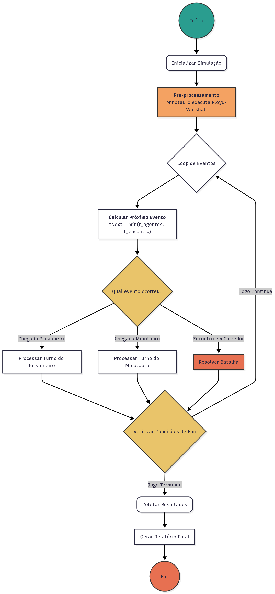
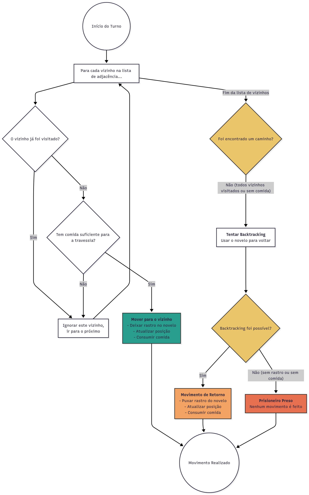
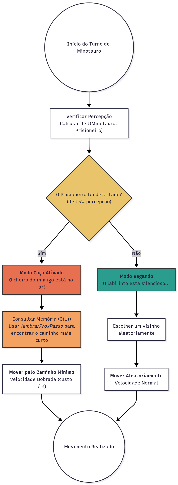

# Labirinto de Creta: Simulação de Fuga e Perseguição

Este projeto é uma simulação computacional baseada na lenda do Minotauro, implementada em C++. Ele modela a dinâmica de um prisioneiro tentando escapar de um labirinto, representado como um grafo, enquanto é caçado por um Minotauro com conhecimento total do ambiente.
Link do video: [https://youtu.be/P-v_R3yjBlI](https://www.youtube.com/watch?v=P-v_R3yjBlI)

## Sumário
- 1. [Visão Geral e Cenário](#1-visão-geral-e-cenário)
    - [Exemplos rápidos](#exemplos-rápidos)
- 2. [Como Compilar e Executar](#2-como-compilar-e-executar)
- 3. [Arquitetura do Simulador](#3-arquitetura-do-simulador-um-motor-de-eventos-discretos)
- 4. [Análise Técnica e Qualidade](#4-análise-técnica-e-qualidade)
- 5. [Testes Automatizados (CTest)](#5-testes-automatizados-ctest)
- 6. [Dicas e Solução de Problemas](#6-dicas-e-solução-de-problemas)
- 7. [Critérios de Avaliação — Mapeamento](#7-critérios-de-avaliação-—-mapeamento)
- 8. [Créditos e Arte ASCII](#8-créditos-e-arte-ascii)
- [Estrutura de Arquivos](#estrutura-de-arquivos)

## 1. Visão Geral e Cenário

Na mitologia, como punição por uma guerra perdida, Atenas enviava jovens a Creta para serem sacrificados ao Minotauro em um labirinto intransponível. A missão deste projeto é simular a jornada de um desses jovens (o *entrante* ou *prisioneiro*) e o comportamento de caça do Minotauro.

### Dinâmica do Desafio

  * **O Labirinto:** É modelado como um **grafo ponderado não-direcionado** `G = (V, E)`. Os vértices (`V`) são as salas e as arestas (`E`) são os corredores. O peso de cada aresta representa o tempo e o custo (em comida) para atravessá-la.
  * **O Prisioneiro:** Começa em um vértice de entrada, não conhece o mapa e precisa encontrar a saída. Ele possui um "novelo de lã" para fazer o caminho de volta (backtracking). Seus suprimentos são limitados, e o tempo é crucial para sua sobrevivencia.
  * **O Minotauro:** Conhece cada centímetro do labirinto. Ele vaga aleatoriamente até que o prisioneiro entre em seu raio de percepção. A partir desse momento, ele inicia uma perseguição implacável, movendo-se pelo caminho mais curto e com o dobro da velocidade.

### Representação e Entrada

O labirinto e os parâmetros da simulação são carregados a partir de um arquivo de texto com o seguinte formato:

```text
<número de vértices>
<número de arestas>
<u v w> ... (arestas e seus pesos)
<vértice inicial do prisioneiro>
<vértice de saída>
<vértice inicial do minotauro>
<distância de percepção do minotauro>
<kits de comida do prisioneiro>
```

Exemplos de cenários estão no diretório `data/`:

- `beco_sem_saida`
- `escape`
- `fuga`
- `morte_fome`
- `perseguicao_imediata`
- `teste_distante`

## 2. Como Compilar e Executar

O projeto utiliza o `CMake` para gerenciamento de compilação.

```bash
# 1. Crie um diretório de build
mkdir build
cd build

# 2. Configure o projeto com CMake
cmake ..

# 3. Compile o código
make

# 4. Execute a simulação
# O executável estará em build/bin/
./bin/simulador ../data/first_test --human
```

Também é possível executar a partir da raiz do repositório, apontando para o binário gerado:

```bash
./build/bin/simulador data/first_test --human
```

### Modos de Execução

O simulador suporta dois modos de saída:

- `--human`: Exibe um relatório detalhado e estilizado, com a linha do tempo dos eventos.
- `--json-only`: Produz uma saída em formato JSON, ideal para testes automatizados.

Outras flags úteis:

- `--no-progress`: Oculta a linha do tempo detalhada (útil para saídas compactas).

Padrões e uso:

- Sem flags, o modo padrão é o relatório humano (`--human`).
- Uso: `simulador <arquivo> [--json-only|--human] [--no-progress]`

Exemplo de saída JSON (campos variam por cenário):

```json
{
    "sobreviveu": true,
    "tempo": 12,
    "tempoReal": 12.000000,
    "kits": 3,
    "posP": 7,
    "posM": 2,
    "minotauroVivo": true,
    "encontro": { "ok": false, "tipo": "", "t": -1 }
}
```

Exemplo mínimo de arquivo de entrada (comentários apenas ilustrativos):

```text
4              # V
4              # E
0 1 2          # aresta 0-1 com peso 2
1 2 1          # aresta 1-2 com peso 1
2 3 2          # aresta 2-3 com peso 2
0 3 5          # aresta 0-3 com peso 5
0              # entrada do prisioneiro
3              # saída
1              # posição inicial do minotauro
2              # percepção do minotauro
10             # kits de comida do prisioneiro
```

#### Convenções e limites de entrada

- Índice dos vértices é 0-based: salas vão de `0` a `V-1`.
- Pesos de arestas devem ser inteiros positivos (> 0); zero ou negativos são inválidos.
- Vértices usados nas arestas e nas posições iniciais devem estar no intervalo `[0, V-1]`.
- Limites práticos: o algoritmo de Floyd–Warshall é O(V^3); para cenários grandes, prefira `V` na casa de algumas centenas ou menos. `E` deve ser coerente com o grafo não direcionado (máx. ≈ V*(V-1)/2).

### Exemplos rápidos

Válido (0-based, pesos positivos, vértices dentro do intervalo):

```text
3
3
0 1 2
1 2 3
0 2 4
0   # entrada P
2   # saída
1   # início M
2   # percepção M
5   # kits P
```

Inválido (índice fora do intervalo e peso zero/negativo):

```text
3
2
0 3 1   # 3 não está em [0,2]
1 2 0   # peso zero inválido
0
2
1
2
5
```

## 3. Arquitetura do Simulador: Um Motor de Eventos Discretos

O coração do projeto é a classe `Simulador`, que funciona como um **motor de simulação de eventos discretos**. Em vez de avançar o tempo em incrementos fixos (ticks), o sistema avança diretamente para o momento do próximo evento significativo.

Essa abordagem é altamente eficiente e precisa, pois o tempo computacional só é gasto quando o estado da simulação realmente muda.

Os eventos que movem a simulação são:

1.  **Chegada do Prisioneiro:** O prisioneiro completa a travessia de um corredor.
2.  **Chegada do Minotauro:** O Minotauro completa sua movimentação.
3.  **Encontro em Aresta:** Um evento preditivo de quando o Prisioneiro e o Minotauro se cruzarão no meio de um corredor.

Notas de desempenho e complexidade:

- Minotauro: Floyd–Warshall O(V^3) (executado uma vez) e consultas O(1) para distância e próximo passo.
- Prisioneiro: DFS com backtracking; cada aresta é explorada no máximo duas vezes (ida/volta) ⇒ O(V+E) por exploração.
- Loop de eventos: avança para o próximo evento (chegadas ou encontro); detecção de encontro em aresta calcula o instante exato no contínuo (sem ticks).

### Fluxograma do Loop Principal da Simulação

O loop principal, implementado no método `Simulador::run`, segue a lógica abaixo:



### Lógica dos Agentes

#### Prisioneiro: Exploração com Memória

O prisioneiro age como um explorador cego. Sua estratégia é uma **Busca em Profundidade (DFS)**.

1.  Ele verifica os vizinhos de sua sala atual.
2.  Se encontra um vizinho **não visitado** e com comida suficiente para a travessia, ele se move para lá.
3.  Se todos os vizinhos já foram visitados, ele está em um "beco sem saída" e aciona o **backtracking**.

O backtracking é possível graças à estrutura `Novelo`, que funciona como uma pilha (LIFO). Cada vez que o prisioneiro se move, ele "deixa um rastro" na pilha.

**Fluxograma da Lógica de Movimento do Prisioneiro (`Prisioneiro::mover`)**



**Snippet de Código: Lógica de Backtracking**

```cpp
// Em src/Prisioneiro.cpp
int Prisioneiro::voltarAtras(){
    if (!novelo.nenhumRastro()) {
        MeuPair<int, int> rastroAnterior = novelo.topo();
        // ... verifica se tem comida para voltar ...
        novelo.puxarRastro(); // Puxa o "fio" para obter a sala anterior
        pos = rastroAnterior.primeiro;
        caminho.push_back(pos);
        kitsDeComida -= rastroAnterior.segundo;
        return rastroAnterior.segundo;
    }
    // ...
    return 0; // Não pode voltar
}
```

#### Minotauro: Onisciência e Perseguição

O Minotauro é o predador perfeito: ele conhece tudo.

1.  **Pré-processamento:** Antes da simulação começar, ele calcula a distância mínima entre todos os pares de vértices do labirinto usando o **algoritmo de Floyd-Warshall**. O resultado é armazenado em matrizes de distância e de próximos passos.

    **Snippet de Código: A Onisciência (Floyd-Warshall)**

    ```cpp
    // Em src/Minotauro.cpp
    void Minotauro::lembrarCaminhos() {
        // ... inicialização das matrizes ...
        for (int k = 0; k < n; ++k) {
            for (int i = 0; i < n; ++i) {
                for (int j = 0; j < n; ++j) {
                    if (dist[i][k] + dist[k][j] < dist[i][j]) {
                        dist[i][j] = dist[i][k] + dist[k][j];
                        prox[i][j] = prox[i][k];
                    }
                }
            }
        }
    }
    ```

2.  **Modo de Caça:** Se o prisioneiro entra no seu raio de percepção, o Minotauro consulta sua memória em tempo **O(1)** para encontrar o próximo passo no caminho mais curto e se move com o dobro da velocidade. Caso contrário, ele se move aleatoriamente.

**Fluxograma da Lógica de Movimento do Minotauro (`Minotauro::mover`)**



## 4. Análise Técnica e Qualidade

  * **Eficiência de Estruturas de Dados:**

      * O grafo é representado por um `std::unordered_map` para acesso **O(1)** às listas de adjacência.
      * O `Novelo` do prisioneiro (pilha) e a memória do Minotauro (matrizes) garantem que as operações de decisão dos agentes sejam extremamente rápidas durante a simulação.

  * **Qualidade de Código e Documentação:**

      * O projeto é modular, com responsabilidades bem definidas entre as classes (`Simulador`, `Grafo`, `Prisioneiro`, `Minotauro`, `Logger`).
      * Todo o código foi **extensivamente documentado** no padrão Doxygen, permitindo a geração automática de documentação técnica.
      * O uso de `CMake` e um script de validação em Python (`scripts/ci_validate.py`) demonstram a adesão a boas práticas de desenvolvimento e teste.

  * **Análise de Resultados:**

      * O sistema fornece relatórios ricos e em múltiplos formatos, facilitando a análise.
      * A dinâmica da simulação é altamente sensível à **calibragem dos parâmetros**. Cenários como `morte_fome` e `perseguicao_imediata` demonstram como o equilíbrio entre os recursos do prisioneiro, a percepção do Minotauro e a topologia do labirinto cria desafios completamente diferentes. A eficiência do algoritmo de backtracking do prisioneiro é testada em cenários como `beco_sem_saida`.

### Complexidade do Movimento do Prisioneiro

O prisioneiro utiliza uma busca em profundidade (DFS) com backtracking, guiada por restrição de recursos (kits) e memória dos vértices visitados.

- Custo temporal por exploração: cada aresta é percorrida no máximo duas vezes (ida e volta), resultando em O(V + E) no pior caso para visitar todo o componente conexo alcançável com os kits disponíveis. Em cada passo, a decisão local examina vizinhos em O(grau(v)).
- Memória: a estrutura de visitados, a pilha do `Novelo` e o caminho acumulado ocupam O(V). Operações de empilhar/desempilhar são O(1).
- Pesos e tempo contínuo: os pesos das arestas determinam o tempo de travessia. O motor de eventos discretos avança diretamente para o instante de chegada, sem ticks; a contagem de eventos ainda é O(V + E) na exploração completa.
- Restrição por kits: uma aresta de custo w só é considerada se houver kits suficientes. Isso efetivamente poda a DFS, podendo reduzir o espaço de busca. Em contrapartida, caminhos viáveis podem ser encontrados mais tarde via backtracking, mantendo a mesma ordem assintótica.
- Efeitos de topologia: em grafos com alto grau médio, o custo por passo aumenta proporcionalmente ao grau do vértice corrente; já em grafos esparsos, a exploração aproxima-se do limite O(V + E).

Observações:

- A estratégia não é de caminho mínimo global; é uma exploração cega com retorno. Portanto, o trajeto real até a saída pode ser mais longo que o ótimo, embora o custo computacional permaneça linear na estrutura visitada.
- A simulação termina em tempo finito: com memória perfeita, não há revisita de vértices sem necessidade; cada aresta é considerada número constante de vezes, e o backtracking esgota a pilha em O(V).

### Complexidade do Movimento do Minotauro

O Minotauro combina onisciência (pré-processamento) com dois modos de deslocamento (aleatório e perseguição):

- Pré-processamento: executa Floyd–Warshall uma única vez para todas as fontes. Tempo O(V^3) e memória O(V^2) para as matrizes de distância `dist` e de próximo passo `prox`.
- Consultas O(1):
    - Percepção: checagem se `dist[M][P] <= raio` é O(1).
    - Próximo passo na perseguição: `prox[u][v]` fornece o próximo vizinho em O(1), permitindo reconstrução do caminho curto aresta a aresta.
- Movimento aleatório (fora da perseguição): seleção de vizinho em O(grau(v)); agendamento de chegada é O(1), com tempo igual ao peso da aresta (velocidade base).
- Perseguição (velocidade dobrada): cada salto segue o caminho mínimo; o custo por evento permanece O(1), e o tempo real por aresta é metade do peso (2× a velocidade). O número de eventos até alcançar o prisioneiro é proporcional ao comprimento do caminho curto (em arestas).
- Integração com o motor de eventos: criação/atualização de eventos de chegada é O(1); detecção de encontro em aresta usa aritmética de tempo contínuo constante.
- Limitações práticas: por conta do O(V^3) e O(V^2), recomenda-se V na casa de centenas. Em grafos desconexos, `dist` pode ser infinito, impedindo detecção/perseguição entre componentes separados.

## 5. Testes Automatizados (CTest)

Este repositório integra testes com o CTest. Para rodar os testes:

```bash
# a partir da raiz do repositório
cmake -S . -B build
cmake --build build -j
ctest --test-dir build -V
```

Observações:

- Os testes executam `simulador` com `--json-only` e validam substrings com `grep`.
- O CMake habilita os testes via `include(CTest)` e adiciona `tests/` quando `BUILD_TESTING` está ativo.

## 6. Dicas e Solução de Problemas

- Executável não encontrado: rode via `./build/bin/simulador ...` a partir da raiz, ou de dentro de `build/` como `./bin/simulador ../data/...`.
- Caminhos de dados: ao executar de `build/`, use `../data/<arquivo>`; da raiz, use `data/<arquivo>`.
- Saída limpa para CI: use `--json-only` para suprimir logs informativos e obter apenas JSON.

## 7. Critérios de Avaliação — Mapeamento

Nesta seção, mapeamos cada critério de avaliação aos componentes e comportamentos do projeto.

### 7.1 Corretude da implementação (40%)

- Dinâmica correta: motor de eventos discretos em `Simulador::run`, com três tipos de eventos (chegada P/M e encontro em aresta ou sala).
- Algoritmos: Floyd–Warshall (Minotauro) em `Minotauro::lembrarCaminhos`; DFS com backtracking (Prisioneiro) em `Prisioneiro::mover`/`voltarAtras`.
- Validação: testes CTest em `tests/` cobrem desfechos esperados por cenário (escapar, morrer de fome, encontro em aresta/sala ou não haver encontro) usando `--json-only`.

### 7.2 Eficiência dos algoritmos (20%)

- Estruturas de dados: `unordered_map` para adjacências (acesso amortizado O(1)), pilha `Novelo` LIFO para backtracking.
- Pré-processamento: Floyd–Warshall O(V^3) executado uma vez; consultas do Minotauro são O(1) (distância e próximo passo).
- Motor de eventos: avança diretamente para o tempo do próximo evento; detecção de encontro em aresta calcula o instante exato durante deslocamentos.

### 7.3 Qualidade do Código (20%)

- Modularização: `Grafo`, `Prisioneiro`, `Minotauro`, `Simulador`, `Logger` com responsabilidades claras.
- Documentação: comentários Doxygen em headers/implementações, README abrangente e `tests/` legíveis.
- Build: CMake com biblioteca e binário separados; CTest integrado.

### 7.4 Análise e Discussão dos Resultados (20%)

- Saída: modo humano com linha do tempo e resumo; modo JSON para análise automática.
- Discussão: README destaca sensibilidade à calibragem (percepção do Minotauro, kits, topologia) e impactos nos cenários.
- Reprodutibilidade: exemplos e testes permitem reproduzir e comparar resultados.

Assunções e limitações

- Velocidades: Minotauro anda ao dobro da velocidade apenas quando em perseguição.
- Distâncias: pesos de arestas representam tempo e custo (kits) de forma linear.
- Sementes: seed fixa (1) no `main`; pode ser exposta futuramente via CLI se necessário para estudos estatísticos.
 - Encontro em sala: se o prisioneiro vencer a batalha, o Minotauro morre e a simulação continua normalmente; o prisioneiro segue tentando escapar.

## 8. Créditos e Arte ASCII

A arte ASCII do Minotauro utilizada/referenciada neste projeto é creditada ao repositório público de ASCII Art:

- "Minotaur" em ASCII Art Website: https://asciiart.website/art/2334

Se você é o(a) autor(a) original e deseja uma atribuição diferente ou a remoção, abra uma issue para que possamos ajustar prontamente.

## Estrutura de Arquivos

Estrutura do projeto (principais pastas/arquivos):

```
include/
    estruturas/      # estruturas auxiliares (lista de adj, par, novelo)
    labirinto/
        Grafo.h        # API do grafo (adjacências e pesos)
        Minotauro.h    # API do minotauro (memória, consultas)
        Prisioneiro.h  # API do prisioneiro (DFS/backtracking)
        Simulador.h    # API do motor de eventos
    utils/
        Logger.h       # Infra de logs e relatório humano
src/
    Grafo.cpp
    Minotauro.cpp
    Prisioneiro.cpp
    Simulador.cpp
    main.cpp         # CLI, modos de saída
data/              # cenários de entrada
tests/             # CTest (asserções em JSON)
```
